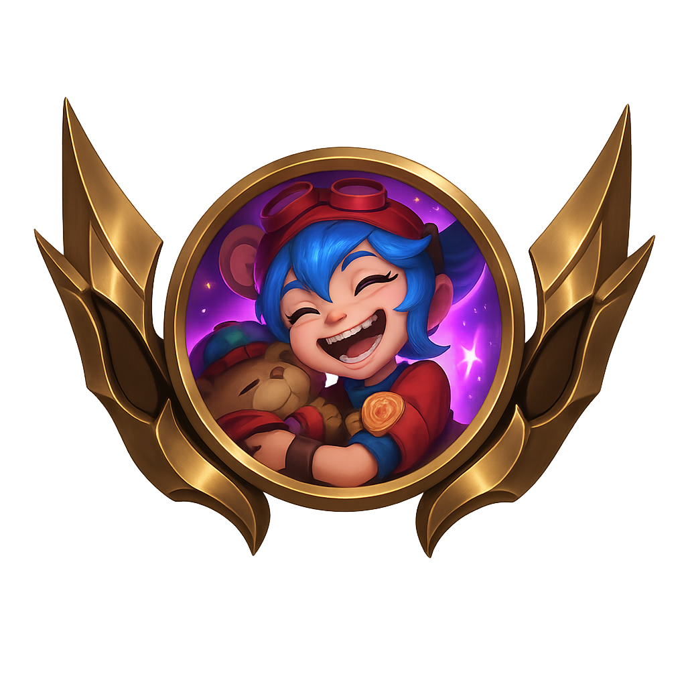

<!-- Header -->

<!-- Title -->
[](https://git.io/typing-svg)

<br/>
<h3 align="center">


<br/>


<br/>


</h3>
<br/><br/>


### About

[](https://phantrungkien.info/)

```java
public class Me extends Human implements Developer, Dreamer {

    private final String aboutMe = """
        - Have knowledge on software development projects 
          (full project cycle, including: initiating, planning, executing, monitoring, controlling, testing and closure phases) 
        - Hard work - progressive - eager 
        - Strong in research & development, also willing to learn new technologies
        - Logical thinking and solving technical issue independent
    """;
    private final String coreCompetencies = """
        - Offshoring / Outsourcing
        - Programming/Testing
        - Requirement/Problem Analysis
        - Code Quality Assurance
        - Sharing Knowledge/Learning
        - Teamwork
    """;
}

```

 <a href="#">
   
 </a>

<br/>


### Tools, languages, and other things that I like to work with.

<br/><br/>
<table style="background: white">
  <tr>
    <td align="center" width="96">
      <a href="#macropower-tech">
        
      </a>
      <br>Java
    </td>
    <td align="center" width="96">
      <a href="#macropower-tech">
        
      </a>
      <br>Python
    </td>
    <td align="center" width="96">
      <a href="#macropower-tech">
        
      </a>
      <br>NodeJS
    </td>
    <td align="center" width="96">
      <a href="#macropower-tech">
        
      </a>
      <br>TypeScript
    </td>
    <td align="center" width="96">
      <a href="#macropower-tech" >
        
      </a>
      <br>Kubernetes
    </td>
    <td align="center" width="96"> 
      <a href="#macropower-tech" >
        
      </a>
      <br>Docker
    </td>
    <td align="center"  width="96">
      <a href="#macropower-tech">
        
      </a>
      <br>Spring
    </td>
    <td align="center" width="96">
      <a href="#macropower-tech" >
        
      </a>
      <br>Postgresql
    </td>
  </tr>
   <tr>
    <td align="center" width="96">
      <a href="#macropower-tech">
        
      </a>
      <br>MySQL
    </td>
    <td align="center" width="96">
      <a href="#macropower-tech">
        
      </a>
      <br>Redis
    </td>
    <td align="center" width="96">
      <a href="#macropower-tech">
        
      </a>
      <br>Kafka
    </td>
    <td align="center" width="96">
      <a href="#macropower-tech">
        
      </a>
      <br>Jira
    </td>
    <td align="center" width="96">
      <a href="#macropower-tech" >
        
      </a>
      <br>Cocos Creator
    </td>
    <td align="center" width="96"> 
      <a href="#macropower-tech" >
        
      </a>
      <br>Docker
    </td>
    <td align="center"  width="96">
      <a href="#macropower-tech">
        
      </a>
      <br>React
    </td>
    <td align="center" width="96">
      <a href="#macropower-tech" >
        
      </a>
      <br>Hasura
    </td>
  </tr>
</table>

<table border="0" cellpadding="5" cellspacing="0" width="100">
    <tr>
      <td align="center">
        
      </td>
    </tr>
    <tr>
      <td align="center">
        <h2>Thôi Để Tao<span>#kien</span></h2>
      </td>
    </tr>
    <tr>
      <td align="center">Gold III 30 LP</td>
    </tr>
    <tr>
      <td align="center">ranked | VN</td>
    </tr>
    <tr>
      <td align="center">Rank #603,589 Top 36.5%</td>
    </tr>
    <tr>
      <td>
        <table width="100%" border="0" cellpadding="5" cellspacing="0">
          <tr>
            <td align="left">Set Stats</td>
            <td align="right">All Queues</td>
          </tr>
        </table>
      </td>
    </tr>
    <tr>
      <td>
        <table width="100%" border="0" cellpadding="5" cellspacing="0">
          <tr align="center">
            <td>
              <table border="0" cellpadding="2" cellspacing="0">
                <tr align="center">
                  <td>4.76</td>
                </tr>
                <tr align="center">
                  <td>Avg Place</td>
                </tr>
                <tr align="center">
                  <td>67 Games</td>
                </tr>
              </table>
            </td>
            <td>
              <table border="0" cellpadding="2" cellspacing="0">
                <tr align="center">
                  <td>41.8%</td>
                </tr>
                <tr align="center">
                  <td>Top 4</td>
                </tr>
                <tr align="center">
                  <td>28 Games</td>
                </tr>
              </table>
            </td>
            <td>
              <table border="0" cellpadding="2" cellspacing="0">
                <tr align="center">
                  <td>9.0%</td>
                </tr>
                <tr align="center">
                  <td>Win</td>
                </tr>
                <tr align="center">
                  <td>6 Games</td>
                </tr>
              </table>
            </td>
          </tr>
        </table>
      </td>
    </tr>
    <tr>
      <td>
        <table width="100%" border="0" cellpadding="2" cellspacing="0">
          <tr>
            <td>Player Tags</td>
          </tr>
          <tr>
            <td>Last 20 games</td>
          </tr>
        </table>
      </td>
    </tr>
    <tr>
      <td>
        <table border="0" cellpadding="3" cellspacing="3">
          <tr>
            <td>Flexible</td>
            <td>Anima Squad Enjoyer</td>
            <td>Prefers AD</td>
          </tr>
          <tr>
            <td>Pacifist</td>
            <td>Chain Losses</td>
            <td></td>
          </tr>
        </table>
      </td>
    </tr>
  </table>

<hr>


